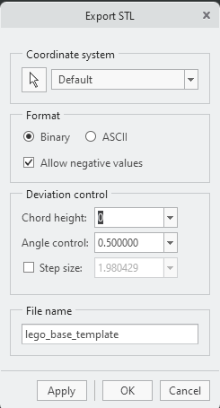

# Build a new lego-setup

## Software Requirements

1. Ultimaker Cura: https://ultimaker.com/it/software/ultimaker-cura/#downloads
2. PTC Creo: Open a new ICT Ticket request (licence server: 7788@iitlicwge005.iit.local)
3. Repositories (all of them must be placed at the same file system level):
    - https://github.com/icub-tech-iit/cad-libraries: In this repository we store the CAD libraries and the PTC Creo configuration files.
    - https://github.com/icub-tech-iit/cad-mechanics: Repository containing CAD for mechanical design
    - https://github.com/icub-tech-iit/lego-setup: Lego Setup

## Print a Part

Building a new lego-setup is as simple as printing a set of parts. The most challenging phase is acquiring the electrical and electronics materials and connect everything.

The phases for printing are:
1. Check the status of the 3D Printer. It must be Turned on and `Ready to Print`.

[ image here ]

2. Open `Ultimaker Cura`

3. Open the `.stl` part you want to print

4. Adjust the orientation of the part as well as the printing settings:

5. Click on `Slice` to see a preview of the printed part and the printing time.

6. If you are satisfied, click on `Print Over Network`:

## Design a New Part

1. Skecth your part on a paper
2. Get all the necessary mesurements
3. Duplicate the base block template: `lego-setup\projects\templates` and rename it w/ your part name

>[!Note]
>If you prefer, you can also start by duplicating other existing parts.

3. Open Creo Parametric
4. Open the duplicated part and start editing/modelling
5. Once you design is complete, if you want to print it, you have to export the part as STL. To do it you have to:

- Click on `File` --> `Save As` --> `Save As A Copy`:

- Select Type: Steleolithography (*.stl) and check `Customize Export`:

- Set the `Chord height` to `0`and click apply:

- Click `OK` to export the STL model.