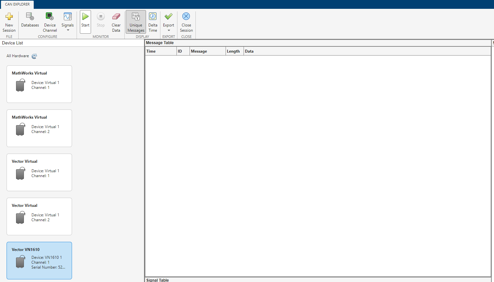
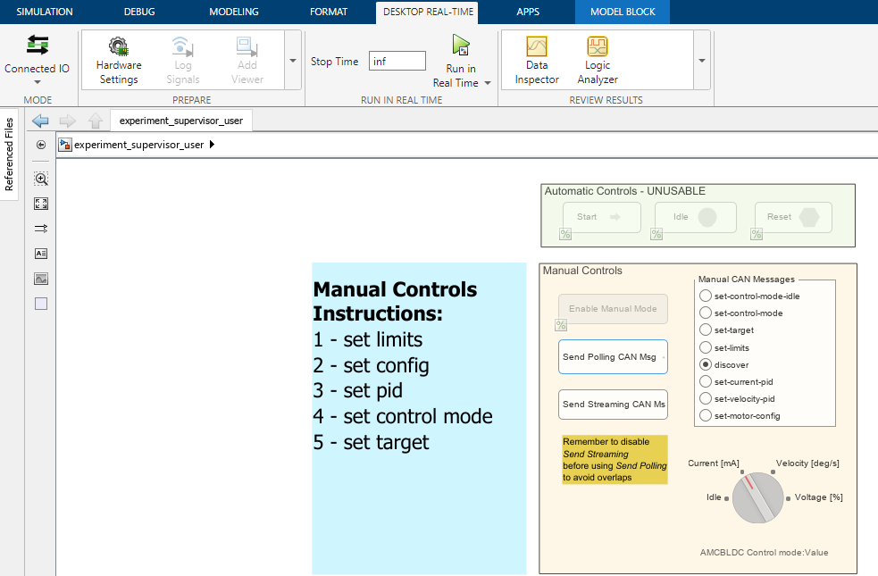

# Test Motor Control on lego-setup w/ Simulink

## Index
- [Software Requirements](#software-requirements)
- [Hardware Requirements](#hardware-requirements)
- [Steps to perform a simple test in Current-Control-Mode](#steps-to-perform-a-simple-test-in-current-control-mode)
    - [Code Generation (Optional)](#code-generation-optional)
    - [Preliminary checks / setup of the Test Model](#preliminary-checks--setup-of-the-test-model)
    - [The Test (Current Control Mode Example)](#the-test-current-control-mode-example)


## Software Requirements

1. Latest release of `Matlab` (https://it.mathworks.com/products/new_products/latest_features.html). For a leightweight installation, instead of selecting ALL the toolboxes, you can select only the followings:
  - [ ] Matlab Coder
  - [ ] Matlab Copiler
  - [ ] Matlab Report Generator
  - [ ] Matlab Test
  - [ ] Simscape
  - [ ] Simscape Electrical
  - [ ] Simscape Multibody
  - [ ] Stateflow
  - [ ] Simulink
  - [ ] Simulink Coder
  - [ ] Simulink Desktop Real Time
  - [ ] Simulink Real Time
  - [ ] System Composer
  - [ ] Vehicle Network Toolbox
  - [ ] Variant Manager for Simulink
  - [ ] Embedded Coder Support Package for ARM Cortex-M
  - [ ] Processors
  - [ ] Control System Toolbox
  - [ ] DSP System Toolbox

2. Install Real-Time Kernel (https://it.mathworks.com/help/sldrt/ug/real-time-windows-target-kernel.html)
```matlab
% In the MATLAB® Command Window, type:
sldrtkernel -install
```

3. Python 3: https://www.python.org/downloads/. 
    - The following `pip3` dependecies are neecessary: `os`, `glob`, `shutil`, `json`, `argparse`.

4. Repositories:
    - https://github.com/robotology/icub-firmware-models
    - https://github.com/robotology/icub-firmware
    - https://github.com/robotology/icub-firmware-shared


5. Install Vector VN1610 Driver
    - https://www.vector.com/int/en/download/vector-driver-setup-for-windows-10-and-11/
    -  Set baudrate for channel 1 and channel 2 to 1000000:

    
        
    - Add MATLAB application:

    

    - Assign VN1610 Channel 1 to MATLAB Application

    

6. Install XL Driver Library 20.30.14: https://www.vector.com/it/it/support-downloads/download-center/#product=%5B%22175%22%5D&tab=1&pageSize=15&sort=date&order=desc

7. Copy `vxlapi64.dll` from C:\User\Public\Public Documents\Vetor\XL Driver Library\bin to C:\Windows\System32


>[!Note]
>Point 6 and point 7 are due to https://it.mathworks.com/help/sldrt/ug/using-vector-can-drivers.html


## Hardware Requirements

1. lego-setup.
2. Power supply.
3. Debugger ULink Pro or STLink V3.
3. Vector VN1610.
4. CAN4 to ESD-CAN Adapter (Wngst code: 3333 rev: A).
5. Laptop or PC.
6. Oscilloscope (Optional).


---


## Steps to perform a simple test in Current-Control-Mode

### Code Generation (Optional)
1. From Matlab, open the `AMC_BLDC` project:


2. With the architectural model opened, press CTRL+D to update the diagram.

3. Click on the `APPS` tab and then click on `Embedded Coder` App.  Now click on `Generate Code 🔽` --> `Generate Code (Generate code only. Do not execute makefile)`.


4. Copy the generated code in to the `icub-firmware` repository:
    1. Open a Command Line terminal
    2. `cd` to `icub-firmware\emBODY\eBcode\arch-arm\mbd\utils`
    3. Run the `copier.py` Python script (see an example below).

       ```console
       > Python3 copier.py C:\dev\icub-firmware-models\boards\amcbldc\codegen C:\dev\icub-firmware\emBODY\eBcode\arch-arm\mbd\amcbldc C:\dev\icub-firmware\emBODY\eBcode\arch-arm\board\amc2c\utils
       ```

5. Build and Flash the application w/ to the board.

### Preliminary checks / setup of the Test Model
1. Turn on the `lego-setup` and set the power supply to 44.0V.
2. Connect the `Vector VN1610` to the board and to the laptop.
3. From Matlab `Apps` tab open the `CAN Explorer`:


4. Start sniffing from `Vector VN1610` (⚠️ not the Virtual one):




5. Open the `experiment_supervisor_user.slx` from Matlab:


6. Some CAN blocks may have been resetted to `MathWorks Virtual 1` device, if this is the case, reconfigure them w/ `Vector VN1610 1 (Channel 1)`:


>[!Note]
>They should be 4 blocks: the global `CAN Configuration` inside the experiment_supervisor block, 2 `CAN Transmit` blocks (🔵), the `CAN Receive` block (🟡).

7. Click on the `Run in Real Time` button ▶️ under the `DESKTOP-REAL-TIME` tab to start the simulation.



8. Select the radio button w/ the `discover` label and click on `Send Polling CAN Msg` button to send a Discover CAN message.

9. Annotate the CAN ID of the board inspecting the CAN Explorer:


10. Stop both the Simulation and the CAN Explorer.

11. Configure the correct `board_ID` of the CAN messages within the `CAN Sender` block:

| | |
| :--: | :--: |
|  |  |

---

## The Test (Current Control Mode Example)

1. Click on the `Run in Real Time` button ▶️ under the `DESKTOP-REAL-TIME` tab to start the simulation.

2. Select the radio button w/ the `set-limits` label and click on `Send Polling CAN Msg` button.

3. Select the radio button w/ the `set-current-pid` label and click on `Send Polling CAN Msg` button.

4. Select the radio button w/ the `set-motor-config` label and click on `Send Polling CAN Msg` button.

5. Select the radio button w/ the `set-control-mode` label and click on `Send Polling CAN Msg` button. 

>[!Note]
>The set-control-mode command will set the control mode actually configured in the Rotary Switch:
>
> 

6. Select the radio button w/ the `set-target` label and click on `Send Streaming CAN Msg` button to send the Current target continuosely. 

At this point, the motor should start moving with the set current target. To view the available signals, we can use the `Data Inspector`:


